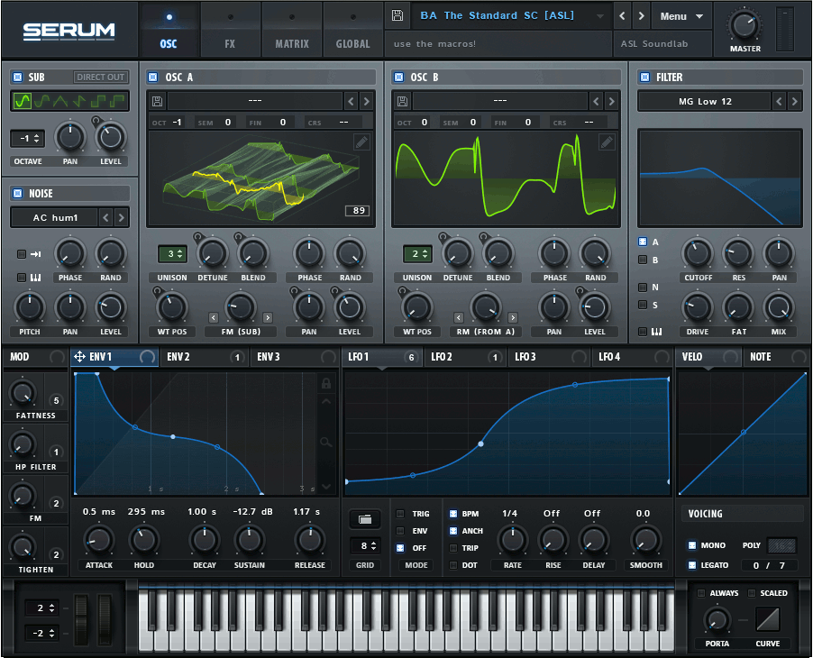

Rather late in my life I decided to make a measured decision to delve headfirst into a career change. Little did I realize what I was in for. Returning to school after over 10 years of a hiatus, was in itself quite the challenge, but I really had no idea how time consuming the CS program would be. It’s definitely been quite a struggle, but it’s one that I’m committed to overcoming. That said, let me just put it out there that I’m definitely not the best coder (yet), but I’m doing my best to get better, and faster at it. So, if you see me looking utterly confused, it’s probably because I am. But hey, I’m determined! That counts for something, right?

My initial interests in software engineering came from two things essentially: 
1) My current career had reached a bit of a dead end a number of years ago, with not much room for growth. It was definitely time for a change, as there was no point in me being a vegetable at a desk.
2) Mobile apps have always piqued my curiosity – especially the range of what you can build, and the audience that you can build apps for. While I haven’t taken much interest in website development, I’ve definitely had a little experience with backend coding, mostly with HTML, and a little with CSS. I’ve also had an interest with developing software interfaces for older hardware synths that never had any apps developed for them - mostly because they were made at a time when running the gear was mostly through midi interfaces and hardware, and DAW’s weren’t really a thing – and also for synths that have lost software support due again to age of the product. 

I’m hoping that my education at the University of Hawaii’s Computer Science Department will help me build the toolset I need to get a decent job working in the field, one which hopefully lends itself to giving me enough funding to start working on my passion projects such as designing software editors for my old hardware synths or just soft synths in general. I feel like I’m just scratching the surface of what is possible with the knowledge that I’ll attain from the CS program at UH Manoa. I truly hope that I’ll be able to expand on the types of projects I can pursue, combining both the need to make money and the pursuit of hobbies I've always had a love for. There’s something that stood out to me in our first class of 314, which was when Professor Moore asked what we were passionate about. It really grabbed me. When I first decided to venture away from college over 15 years ago, that’s what I pursued – may passion. But when it didn’t quite gain the success I had hoped, I ended up at a job that fit my skillset at the time. I remember in my first month there, my CEO very specifically said to me, “Ramit, I don’t understand why anyone would pursue a career that didn’t tie into what they love to do (referring to herself in that particular conversation).”  … well, after 10 years in that job, here I am. Maybe I’ve come full circle. I sure hope so.

