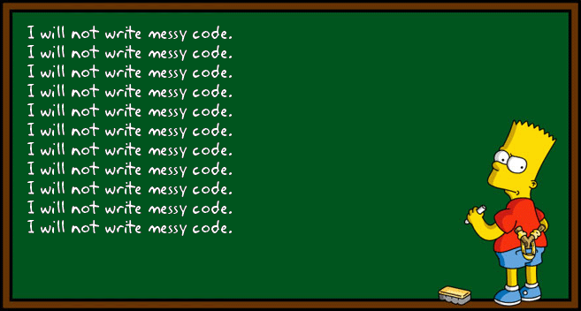

## *“Always code as if the guy who ends up maintaining your code will be a violent psychopath who knows where you live”* **― John Woods**

While I was looking up quotes, to find some inspiration for this write up, I  found two that stood out, the first one, "Talk is cheap, show me the code," is by Linus Torvalds, but it was the second one by John Woods that really caught my eye and gave me a bit of a chuckle.

### Why is it important to develop and maintain good coding standards?

Well, for one, I really think it'll make you a better coder in the long run. And who knows, maybe the guy ends up maintaining your code really *is* a psychopath! And what would upset him/her more than looking at thousands of lines of sloppy, undecipherable code to sift through?

I truly believe in the importance of learning proper coding standards and habits from the beginning of your career as a programmer, and I appreciate that all my professors at UH so far have insisted on instilling that mentality into us in each class that I've taken there. It's similar to how my parents taught me how to write clearly and properly when I was young. Going back to when I was in elementary school had to do handwriting exercises daily, and write reports weekly, just so I could learn to write better as I was growing up. Fast forward til now, and unfortunately my handwriting is still pretty terrible, but I understand the reasoning behind the exercises at least!

It's important that your code is "healthy" and free of errors, and ESLint helps to provide guidance with that. Initially when I started to use it, I was a bit frustrated with not getting the green checkmarks that quickly, but the more I use IntelliJ for coding, the more I'm starting to get used to the red squiggly lines, and the hints to what errors I'm making. Right now, it seems to be a lot of errors, but I've found myself slowly catching things before needing to hover over the squiggly lines to see what I'm doing wrong. Is that making me a better coder? Yes, I think so. Do I have a long way to go to be a better coder? Absolutely, but at least with ESLint installed, I'm able to see errors quicker, and learn from my mistakes quicker.

### In the real world ...

When you're out in the real world, working for your self or for a company, it's also very important to adopt better coding standards. Why? Because having this type of practice makes you a more efficient coder, and being more efficient, in the long run, means you're a better employee who can code faster and with less errors, making your company more money. Efficiency also lends itself to avoiding performance issues and possibly security issues as well. It also helps you reduce the complexity of your code, which makes it easier to read, and easier to find bugs, easier to reuse and ideally easier to maintain ... and if it's easier to maintain, well, I guess you won't need to worry about any violent psychopaths showing up at your door, right?

