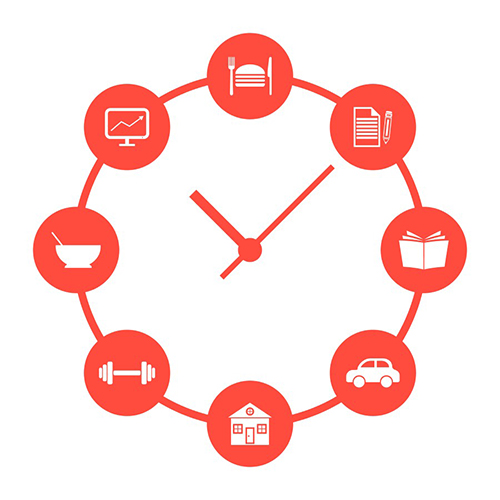
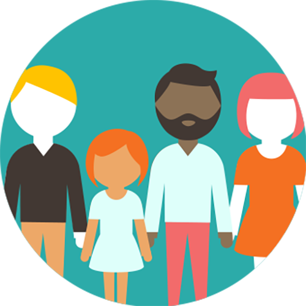

 

Wow, so where do we start on this essay? There’s so much I want to express, but at the same time, I realize that the problem is so much bigger than just me. I’m sitting safe and cozy in a home with most of what I need, while there are people dying as a result of Covid-19. And who knows how many millions could potentially die in impoverished countries where there is absolutely NO possible way their healthcare systems can cope with the spread of this virus. 
 

## Daily Routine

However, since this essay is about my worries, however minuscule they may be in the grand scheme of things, I’ll focus on them. How has my daily routine changed? Well, for one, I wake up a bit later in the morning, just because I don’t have a commute time anymore. Commuting from my bedroom to my studio room to log-in for work takes about 15 seconds. I’m thoroughly enjoying not having to get ready for school or work. It’s given me more time in the day to get things done, which is great. I do miss the physical connection and social interactions with classmates, co-workers, and people in general. My wife’s also working remotely, and we’ve somehow managed not to get on each other’s nerves in the slightest, but that’s probably because we’ve set some boundaries and space between us. And she’s a great cook, so eating her food for 90% of our meals and not spending money on take-out is quite welcomed. Not much else has changed really. As an ICS student, I barely had a social life, so I’d say I was well prepped for social distancing anyway. I’m also watching/reading the news a bit more frequently, and with the time saved from commuting I think we’re doing a much better job at keeping our house clean.

 

## Work, Family and Community

Fortunately for me, I’ve been lucky enough to work remotely. However, as I’m new at STAR, I’ve got quite a lot to learn, and even though we have the tools to share screens, use voice channels, etc. I still find it challenging asking for help – and since I know almost nothing about using AngularJS, I often find myself asking for a lot of it. On the one hand, it’s better that I look for solutions on my own, but on the other hand, I find myself being a bit slower asking for help when I need it. I just hope that doesn’t hurt me too much in this new job.

Family obligations have mostly consisted of my wife scolding her parents about being careful since they both have to go to work physically, and they tend to not take these kinds of things too seriously, and me scolding my parents about the same things. My father doesn’t even have to work, yet he feels he needs to go to the office to do god knows what? Check his fish tanks or something. But he lives in Dhaka, so I have no way of trying to make sure he actually listens. My mother is sadly stuck in Dhaka (she was there on a trip to do research for a book), due to a series of cancelled flights and lockdown on airports. We’ve already lost a decent amount of money on flight re-bookings, and now we are trying to figure out ways to mitigate her bills while she’s away. Two months ago, when I was at my previous job with my previous pay, it would not have been an issue, but after having moved over to my current job, so I could learn how to be a better coder while taking a 75% pay cut, it’s definitely stressing me out. A lot. 

We have tried to be mindful about our neighbors as well. My wife and I have been talking about leaving a note to our elderly neighbor, offering our assistance should she need it. I think her son and daughter come around to help, but since we are right here, I feel like we could at least let her know we’re here for her. Two of my other neighbors are a couple that used to work in the bar industry, not to mention at our two favorite bars in town, and I know they are definitely out of work. My wife and I are trying to think of a tactful way to let them know we’re here for them, or give them a VISA gift card for groceries, or something. We don’t want to cross any boundaries, but we want to help if we can. It’s a touchy subject, and we just want to be tactful about this. We’re trying to help local restaurants out by frequenting at least 2 per week (when we go out to get groceries or other supplies), and reposting pictures of whatever meals they might be offering to hopefully convince others to support them if possible. I doubt McDonald’s needs our help, but spots like Restaurant XO or Off the Hook need our help so they can stay open. Some of them have landlords that don’t care if they can make rent or not, and at a time like this, it is infuriating to hear. There’s only so much my wife and I can do, but hopefully by getting the word out to others, the community can help. At times like this, I wish I’d already graduated and was making 6 figures like some of my friends are – there are so many people and businesses that can use our help right now, and in the upcoming months, and I feel like I can’t do nearly as much to help as I’d like to.

With regards to my online social life, I’d have to say that it’s been a great time to reconnect, check in with others in hard hit areas like Italy, Seattle, NY, etc. Their fear is palpable. I wish I could offer them more comfort, or some solutions, some ease of mind maybe. While it’s great to be in touch with them thanks to technology, it’s also frustrating not being able to do much more. It’s also frustrating knowing that people in the hardest hit areas are seeing the reality of how bad things can possibly be, while others here in Hawaii (speaking of those on my friend’s lists) are galivanting around thinking nothing will happen to them. What’s more annoying is seeing just how many people think the whole thing is fake, or how 5G is the cause of Covid-19 and how apparently Bill Gates is developing a vaccine that will embed microchips into our bodies so that the government can mind control us into thinking the earth is flat. I mean who would have thought that 2020 would be year of misinformation and conspiracy theories? We don’t need more division and hatred. It’s absolutely disgusting to see how much hatred is being spewed out at our Asian American brothers and sisters due to Covid-19 and a certain “leader” perpetuating bigotry towards them. And now, Dr. Fauci, the nation’s top infectious disease doctor, is getting threatened by some of these same conspiracy theorists? Sorry for going off on a tangent, but it’s too much…  I’ve done a LOT of spring cleaning on my Facebook page as a result. 

 

## College & COVID

While I’ve had semesters previously where all of my classes were online, it’s been weird adjusting in-person classes to online only ones. I really enjoyed having conversations with my classmates. It made the classes seem more … “real” … and it put more urgency to making sure that I got my assignments done on time. I don’t think there’s much room to slack off in 314, but I can’t really say that my time management’s been great. Furthermore, I was finally starting to do well in my WOD’s, which was a great feeling for someone who DNF’d as many as I did initially. The adrenaline rush from “yes, I finished!” is gone, and I miss it, but I don’t mind the new system as much. With the Meteor experiences getting harder as they go along, I’m completely fine with having the extra time to do them. However, for my mobile app design class, my partner and I are both having problems keeping up. I think having classes twice a week gave us real deadlines, and face to face talks (even though we can do it via discord or other technology), inspired us both to do more. Now, I feel as though we’re both struggling to get our project moving at a steady pace. Furthermore, we have hit a brick wall with the evaluation process due to all the shutdowns. It’s no longer possible to reach our intended audience for testing, so we’re having to rely on family, but I doubt we’ll get the feedback that we need from them. My third class was online anyway, so that’s fine as there isn’t any additional adjusting that I need to do for that class.
 

## Moving Forward

As far as school is concerned, I think I’ll be able to adjust to doing all online courses again. I think our current situation will help push the technologies that will make remote working and online classes easier for everyone. Maybe by 2021, 314 will have virtual versions of Professors Johnson and Moore instead of in-person classes. 

In my previous job, I was completely comfortable working remotely, but for my current job, I’m undecided, and it’s mostly because I think I can learn more, quicker if I’m physically at an office with my coworkers. I do worry about my job stability, however, as I’m the low man on the totem pole. Being laid off at this point in time would greatly impact my ability to graduate in time. However, a recession is imminent, and I’m still a bit traumatized by the last one. I lost a lot at the time – I got laid off and as a result my car was repossessed, my credit absolutely crushed, my student loans went into default, and that was just the tip of that iceberg. I don’t think I’ll have to resort to having to ration my food down to a single can of tuna a day, but I’m still wary of the grim possibilities that come with a recession. 

I suppose the best we can do is stay safe and be as prepared as we possibly can to weather this storm. It’s just a shame that our country and leadership (lack thereof) was not prepared despite all the warnings we received. I hope for the best, not just for me and my family, but our neighbors, our island, our country, and mostly importantly the entire planet.  

 
 

