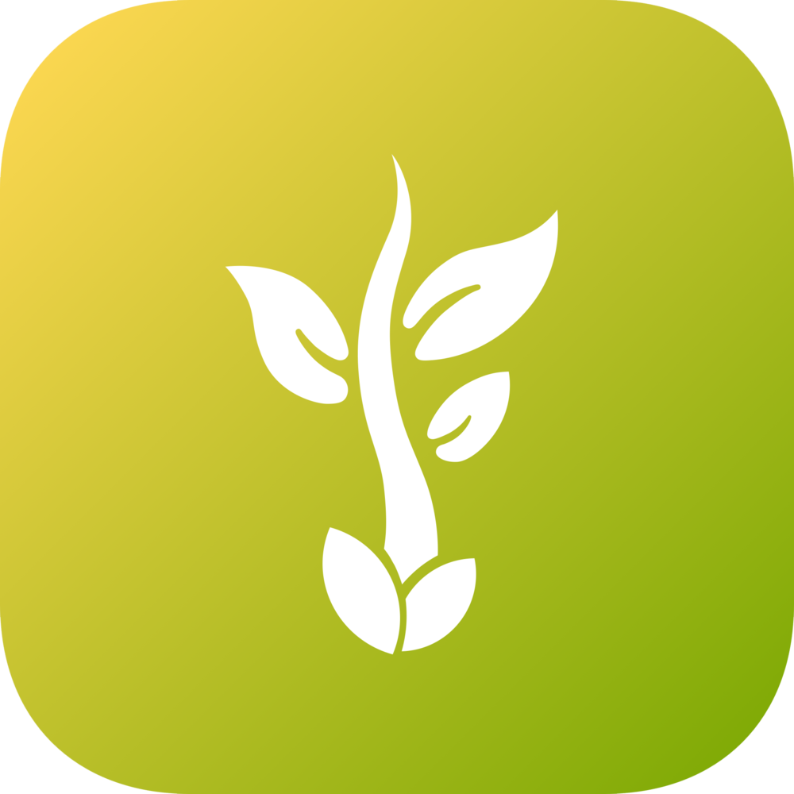

 

# Project: APPleseed

## Overview
***The problem:*** There are possibly hundreds of different problem areas that students have encountered which could be solved (to some degree) via the utilization of an app. However, ICS students (or other budding developers) may not have thought of them, thus they would not know that there’s a need to make an app to help address those issues. This app could be beneficial to the group mentioned above as well as ICS students looking for project ideas in upper level CS classes.

***The solution:*** This app would let UH Manoa (or UH system) students, teachers or staff submit ideas that could help benefit or improve their lives. Perhaps several topic areas could be suggested, and a rating system implemented to help decide which apps would actually make it into development.
 

## Approach
For this app we would need to create a way to allow faculty, students and staff submit their ideas in a form with their ideas, contact info (to discuss their ideas further for development purposes), perhaps some radio buttons or checklists to select topics or problem areas, and a rating system so other users in the UH system could help vote to see if the app idea is useful.

* All app idea submissions would have to come from UH students, faculty or staff
* Submissions must be submitted using UH credentials
* All ideas would need to be approved by admin before going live (to help weed out spam posts)
    
Potential mockup pages include:

* Landing page
* Add user page with contact details
* User home page
* Login section on Nav Bar
* App idea submission page with editing features
* Apps rating/viewing page, with options to select view (highest to lowest, lowest to highest, most recent, oldest, etc.
 

## Use case ideas

Here are some use cases, but it’s possible more might be added if the project actually gets developed.

* New user goes to landing page, logs in, gets home page, sets up profile. (A brief description of how the system works will be on the landing page)
* Admin goes to landing page, logs in, gets home page, edits site.
* Admin goes to landing page, logs in, goes to app submission page, approves/denies submissions
* User goes to landing page, logs in, goes to app submission page to suggest app idea
* User logs in, edits app idea
* User rates other app ideas
 

## Beyond the basics

After implementing the basic functionality, here are ideas for more advanced features:

* ICS Student/dev login page
* App development progress page (for the apps that have been selected)
* App download page for testers
* Evaluation/feedback page
* Final app download link for the general public 
* Monetization incentives for developed apps

 
 

