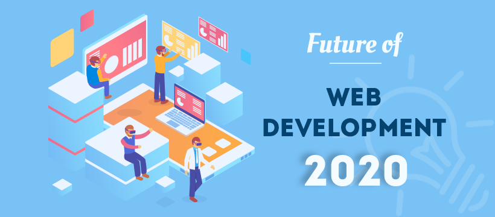

### 404 Errors!

My first real exposure to web design was a few decades ago when I learned some very basic HTML skills and used Dreamweaver to code my own personal site. My next use of any HTML was on Myspace (I think), and well, I try to forget about that social media train-wreck. Fast forward a few more years, and I was fiddled around with more of it for the non-profit organization that I was working for up until recently. I knew I needed to learn CSS for the latest makeover of their site, if only to tweak the WordPress templates that we used to design it, but never had the time to really get into it (since web design wasn’t my primary job there). When we first started that section, I was quite excited about the prospect of learning more about both HTML and CSS, only to find out a week later that there was a MUCH better way … and it was called Semantic UI! Compared what I made during a WOD in this class, my first HTML sites look like they were designed by a caveman!

### Love at First Sight …

As a huge fan of minimalism and design, I loved how Semantic handes both. The flat design look provided a clean feel to it, while also maintaining a lightweight experience for the coder. The fact that Semantic provides a variety of themes to help your design look simple, yet stunning (with the right eye for design, of course) was very appealing for me. Even thought my experience with HTML was limited, and CSS even more so, the Semantic framework made web design seem much more fluid and simpler to implement. Customization options seem straightforward and for a beginner like myself, the learning curve doesn’t seem as complicated as I would have imagined. Granted, I haven’t had a lot of time to really dive into all the features and UI components, the documentation that Semantic UI offers seems to make learning easy, and definitely less daunting that using HTML/CSS alone.

The Semantic framework gives you great looking, UI out of the box with consistent design aesthetics, which I believe can be helpful for web developers who aren’t necessarily great designers. It also provides a really good starting point, and groundwork for new developers, like me, to build our skills without feeling intimidated by coding. Semantic’s use of plurality in their coding structure and simplified “common-language” for their interface elements is a HUGE advantage, for newbies and experts alike. Their code is reliable, tested, and well suited for a variety of browsers, and this is important so you have some confidence knowing that your site will work on at least the key browsers.

### Future Frameworks

Sure, anyone can just use site builders like WordPress, Wix or Squarespace to build a beautifully themed site, but creating one from scratch is much more satisfying, and understanding how the internal nuts and bolts of a website function is why I’m here. And that said, I’m very interested in learning about React and Meteor this semester as well as the other frameworks that are out there such as Bootstrap, Vue, Flutter and AngularJS (the last of which I’m currently having a bit of a nightmare experience with).
