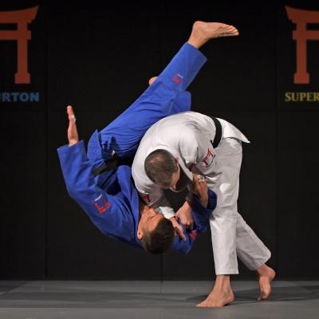
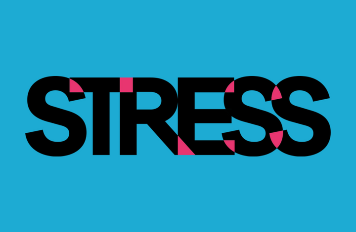

The one thing I loved about the Javascript learning modules is that they were quite simple to do for the most part. Since I had already learned Java a few years ago, it was helpful in refreshing some of the basics for me. However, it also made me realize that a “few years ago” seems like a lifetime ago, and I’ve forgotten quite a bit. So, although I’m not a newbie per say, at times I definitely felt like a newbie.

The ES6 modules were very useful as well. I do wish that I spent more time going through them, however. At one point, I think I started to get quite frustrated as to how much time the modules were taking up, and I started to rush through them. I wish I hadn’t, but considering the other homework I had, and other life/work obligations, time was tight, and I didn’t have enough of it, even with the long weekend. That was the most frustrating thing for me, and I know it’ll remain a theme – or a thorn, I should say – for the rest of the semester: that I don’t have enough time!

I can’t really say if Javascript is a good or bad programming language until I have enough programming experience in a variety of languages. Sure, I’ve had experience with Java, C and C++ at school, but it’s not enough for me to have an educated opinion on any of them. There are so many factors to consider, and I’m not well versed enough to even consider them insightfully. Ask me again in 3 or 4 years after I’m able to get establish proper love/hate relationships with programming languages.

I do like the idea of athletic software engineering. It prepares you for the real world, and especially for interviews. Just last week I had an interview for a job at STAR, and I know I BOMBED the coding part, just because I’d never experienced anything like that before, and I got super nervous. Had I taken this class prior to that interview, I’m sure I would have done better. My main issue (it’s personal) with the concept is that I’m not a great coder. I’m slow. And I get nervous with timed tests. I know these things are going to work against me. I’m trying to get in as many practice WODs as I can, but considering the immense amount of time this class takes up (and I can’t help it, but I absolutely HAVE to work so that I can survive and actually pay for school), I’m extremely worried about my performance in the WODs and how they might affect my overall grade. I was hoping that since this class was not categorized as WI, that there would be less work, but apparently that’s not the case. All these things worry me. And yes, it is absolutely stressing me out. I considered dropping this, or one of my other classes so I could focus, but I just can’t afford to do that and extend my semesters in school out any longer. The pressure is on. It’s do or die for me, so I’m determined to do my best. I’m just hoping that I manage to make it past the finish line, since I may not be able to give myself a mulligan.

Github edit.
