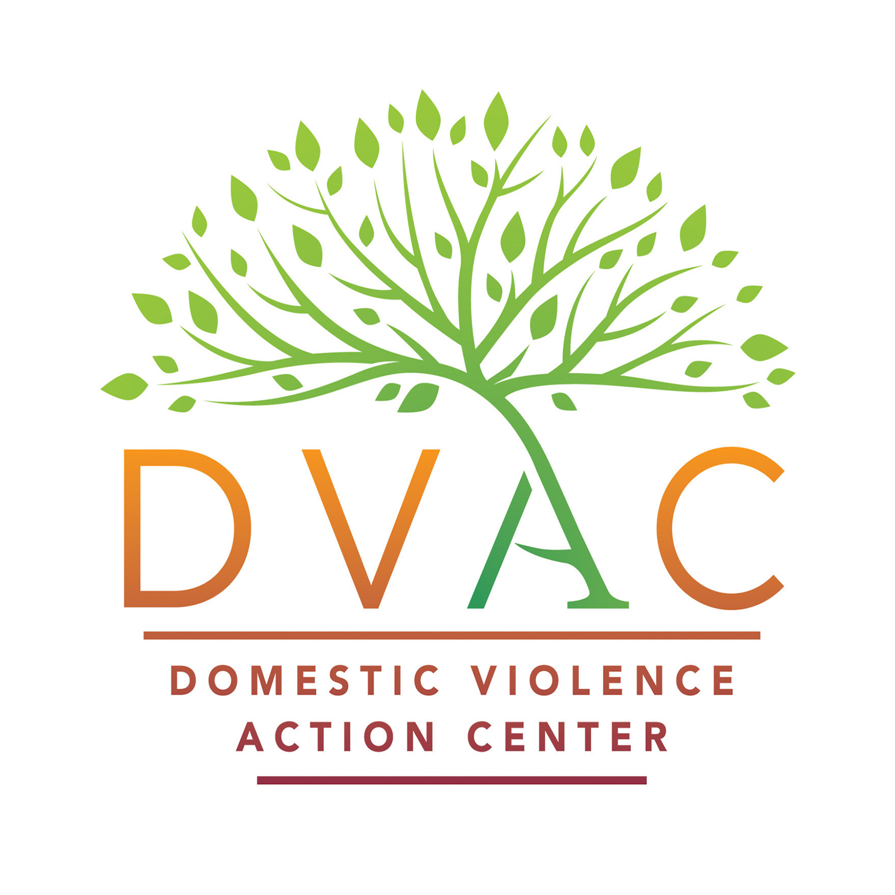
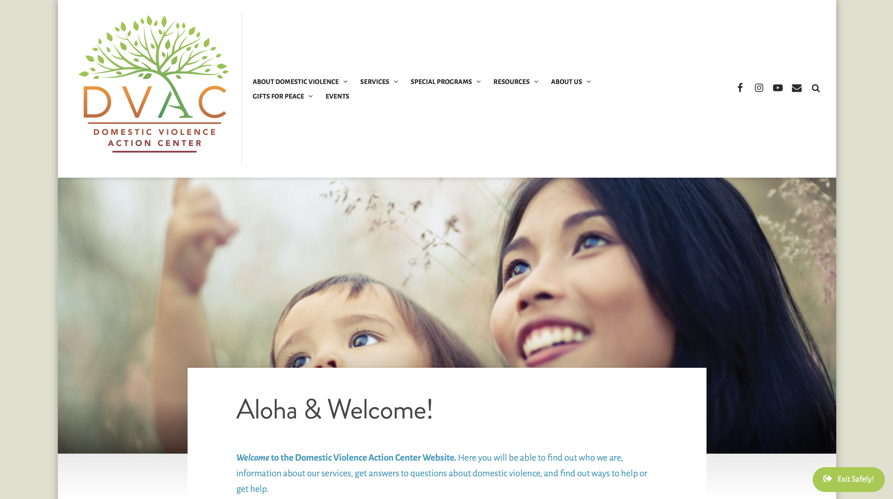

 

 

In late 2013, the non-profit agency I worked with started to plan their 25th Anniversary celebrations. The idea was to do a year-long series of events, which culminated with a reveal of a new logo and the launch of a new website, followed by a redesign of all of our main agency collateral pieces, all of which was to happen in October of 2015. It was a monumental task to oversee, as the event management and planning itself was enormous in its scope. While I won’t focus on all the details of the event planning, I do want to talk about the rebranding effort which I was the proudest of.

While Domestic Violence Action Center's CEO wasn’t initially thrilled with the idea of changing the logo, everyone on the board felt it was time for a refresh. I was on their side on almost all aspects, until it came time to discuss who should do the logo/branding design. Quite a number of them thought we should try it ourselves (meaning me), while others felt that we should use one of those cheap logo bidding/outsourcing sites. I disliked both ideas, and felt it was best to have a professional with experience do it, but those definitely cost a pretty penny just for the logo design along, without even getting into website design and collateral design. So, much to my (and another board member’s protest) we went with a few cheap bidding logo sites, wasted about $500 and ended up with 3 or 4 extremely corny logo ideas. This gave me and the other board member a little weight to push through our idea to just hire a professional. I happened to know a few up and coming graphic designers, and we ended up hiring one that fit and understood the mission of our non-profit. We went through a 3-month process and finally ended up with a fresh design with a look and feel that everyone loved.

 

 

The next part of the project was getting the <a href="https://domesticviolenceactioncenter.org">DVAC Website</a> done. Again, as we are a non-profit, we didn’t have the funds to hire a professional, especially since we just paid $12K for our logo redesign. After trying to filter through 5 or 6 “volunteers” that wanted to help and 2 recent UH grads – ALL of which flaked out – I finally decided to take on the task myself, as we were running out of time to complete the project in time for our big reveal. I had done some HTML coding in the past, and a very small amount of CSS, but I was in no shape, skills-wise or time wise, to create something from scratch. After consulting with some friends, I decided to build the site using wordpress, as they had a wide range of themes that allowed for easy implementation and modifications. Although the final result was far from what I had story-boarded for the UH grads and volunteers to design (there are limitations on what you can do on Wordpress), I was definitely content with what I’d come up with, as was our CEO and our Board of Directors. 

Although we didn’t quite get all the collateral redesigned in time, the logo and website updates definitely brought us out of the early 2000’s and into 2015. 
 
 
