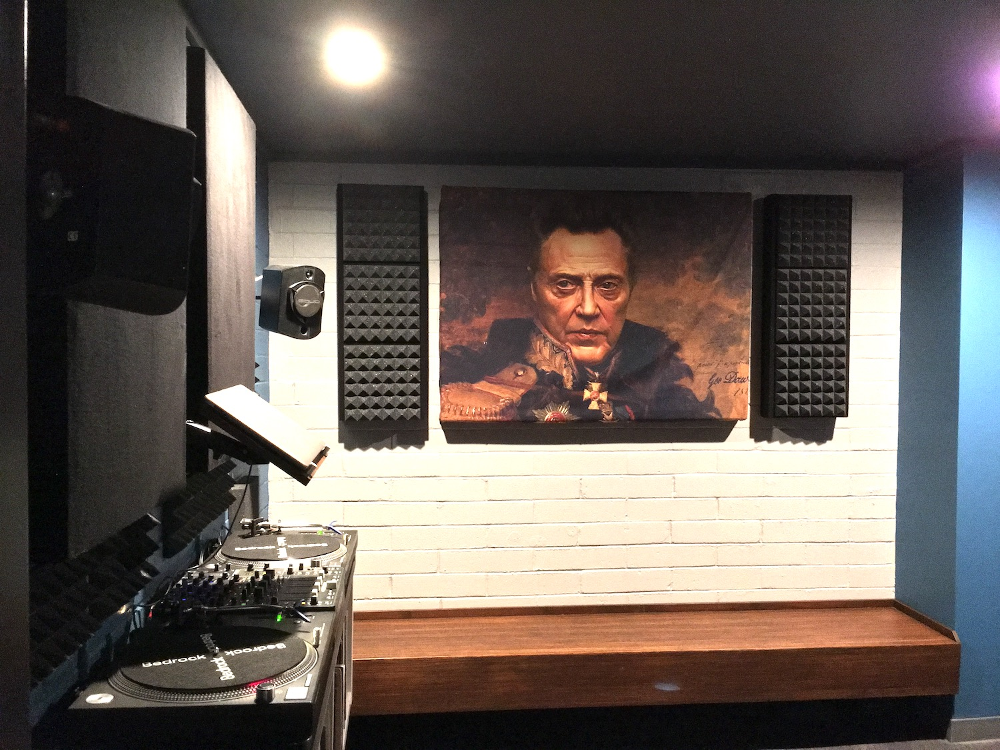
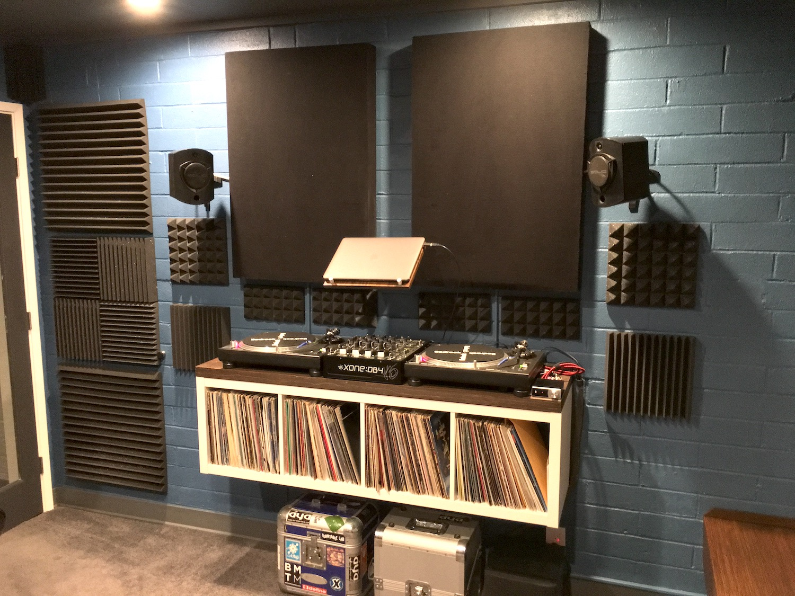
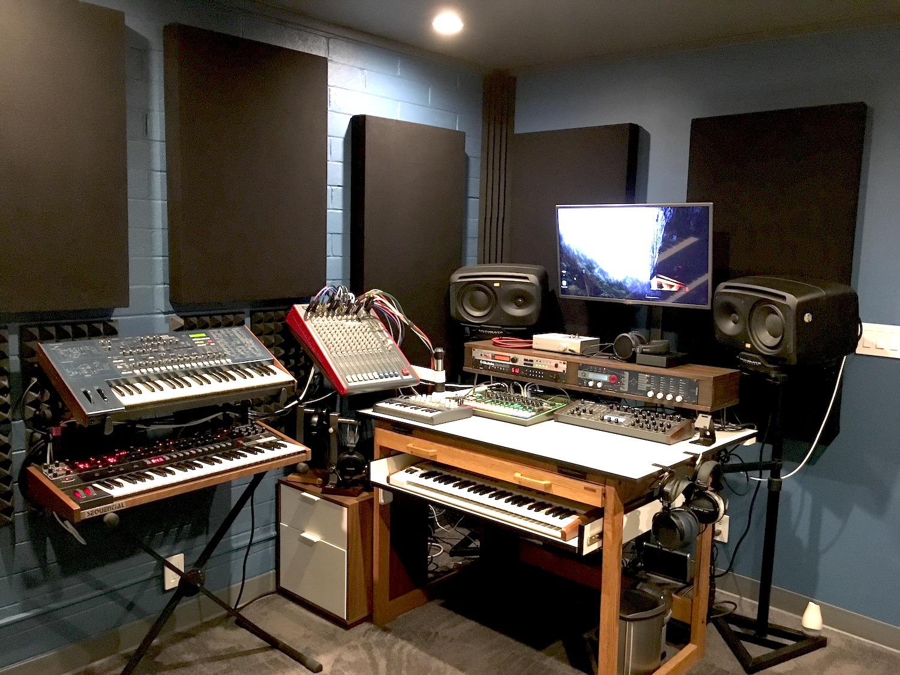

 

 

**As I'm sure I mentioned a few times** in my profile, I'm a bit of a music fan. About 6 or 7 years ago, my wife was in the process of redesigning the downstairs portion of her house so we could move into it. She knew I always wanted to have my own studio, so she asked me if I’d like to have my own space for it the newly renovated space. Of course, without any hesitation, I said, “YES!” … there was one caveat though, and that was that I had to build it myself. She would extend her old walk-in closet into 1/3 of her old bedroom, and I could 1/3 of the space for my studio, and the outside area as a lounge. I just needed to design and build it all myself. I love a good challenge, so I took her up on it.

 

 

It was a lot more work than I had imagined. I basically had to do everything from water seal the walls (Manoa has a ton of moisture seeping through, especially in certain portions of the house), even out the floor, lay down carpet, do the side moldings, paint the walls, build a floating bench (wow what a PAIN that was), source soundproofing materials (which were not available on the island) and use them to build sound absorption panels, repurpose and modify my wife’s old architectural drafting desk into a studio desk (I preferred this idea over buying a new one, as I’d always wanted to be an architect – next life, I suppose), find create ways to mount my mixing board and float my DJ booth without having things crash down and get damaged, build headphone stands and synth racks from scratch, learn how to stain and finish wood properly, and the list continues … 

 

 

And that was just the music studio. The adjacent lounge wasn’t as tedious to do, but I made an idiotic mistake in the process of building out the music studio: I forgot to cover the floor properly, so while I was staining wood, sanding, painting, coating all the pieces for the other room, quite a lot of the laminate floor got damaged. Fixing that without replacing the entire floor was immensely difficult. In the end, I just ended up being creative with how I placed all the furniture and the area rug.

 

 

I have to admit, the music studio was one of the most satisfying projects I have ever worked on. The lounge came out quite nice, too, but it’s the music room that I love to show off to my friends. Ironically, I’ve been so busy with work, and now the CS program at UH, that I barely have time to make use of it. Maybe after I’m done at UH, I’ll finally take a breather and get back into the studio.
 

