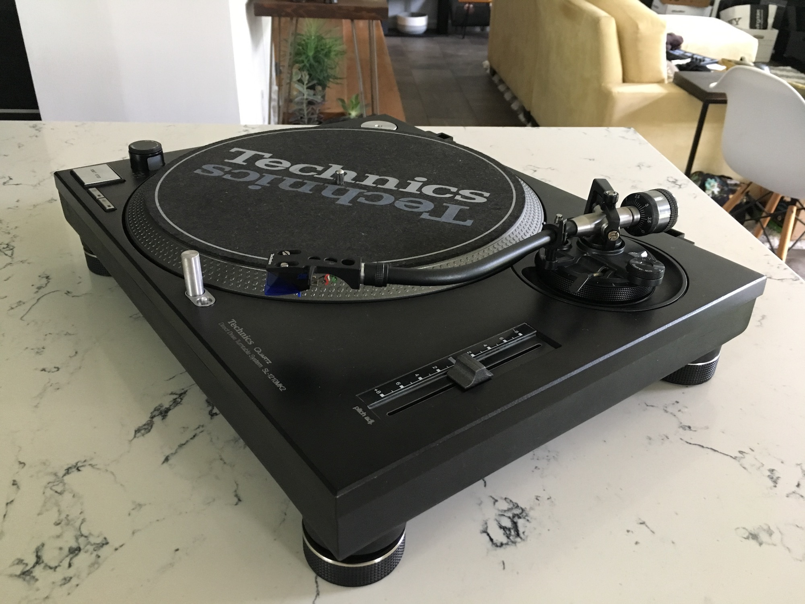

 

**A few summers ago,** a friend of mine was trying to get rid of some old, disassembled Technics 1200 turntables he had laying around. They were in absolutely horrible condition, with some parts spray painted, tonearms bent, motherboards fried, platters rusted, plinths with the paint eroded – in a nutshell they were ready for the landfill.

He sent me a picture of the pile of “garbage” as he called it, and I instantly fell in love. *Note: I've since lost that picture and all of the "before" pics that I took - the one above is a representation of the condition the turntables were in.* __I saw potential!__ I’ve been a fan of Technics 1200 turntables since a teen and used them to learn how to DJ way back when – I had a very strong connect with that brand and that model. Although I’d never actually rebuilt a turntable before, I’d made minor fixes to my old ones before upgrading mine. I saw the challenge and accepted it. Did I know how to solder? Nope. Did I know how to properly strip paint and repaint metal? Absolutely not! Were my first attempts to do all of those things a success? HA! No way. It was a disaster! I eventually figured out that it was less painful to outsource the strip/paint job to a professional (and the outcome was way better than what I had done). The soldering bit improved with some practice, enough to make sure all the internal components worked well. Testing the old parts to figure out what worked and what didn’t was a bit tedious, as was finding replacement parts online at decent prices – keep in mind that Technics decided to discontinue the 1200 line a few years earlier, so Ebay sellers were not gentle with spare part prices.
 
 

 

**In the end,** the process was rewarding, even though it took a toll on my wallet. Rebuilding two turntables from a pile of what was basically rubble, was a great, satisfying experience, not to mention they look pretty amazing in my eyes. It was a great learning experience, in which I learned from both my failures and successes in the rebuild/refurbish process. Not that I have time to take on a project like this again, but I;m already thinking about the next upgrade I'd like to perform on one of the turntables. The entire experience was worth the time and money spent. 
