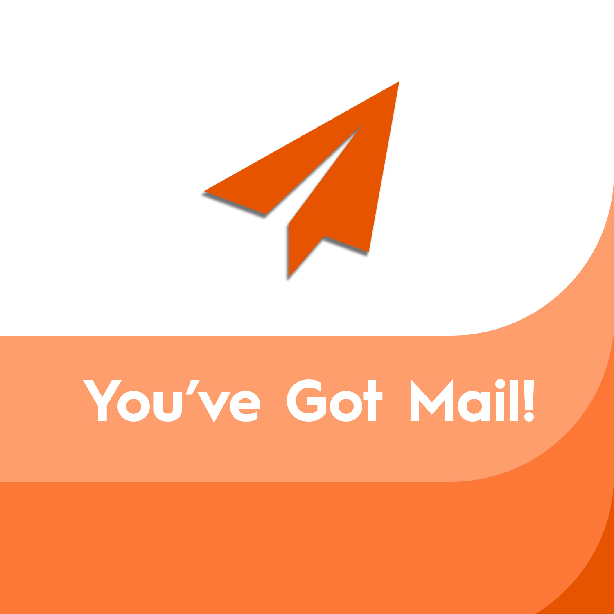
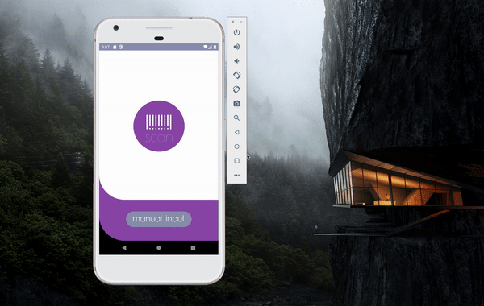

 

 

# You've Got Mail!

No matter how advanced technologies get, they are developed with a purpose of eliminating or alleviating a rather primitive dilemma of time management and cost savings.  There is no single solution to these problems, but there are many remedies that can ease those stresses.  “You’ve Got Mail!” is a mobile application that contributes to such a cause in a way that eliminates unnecessary commutes to the post office.   

## Core Concept

What exactly is “You’ve Got Mail!”? The idea was conceived from an issue I was having when I first started renting a PO Box for my father who lives abroad.  I found myself going to the post office a few times a week to check the mail for him. Most of the time the box was empty, so I started going once a week, then every other week, and so on. However, he would call me every so often to let me know there would be some important mail coming, but I never really knew when to expect it, so I was back in the same cycle of wasting time and gas driving. At the time I thought to myself, “why don’t they have any sort of notification app?” … fast forward a few years, and here we are developing that exact thing!

 In its simplest form, the concept of “You’ve Got Mail!” would function as such: the P.O. Box rental facility would utilize the app to push a notification to the PO Box user, letting them know that they’ve received mail. The notifications could be as simple as letting them know they received regular mail, or packages, or that their box is full, for example. The application’s main purpose is to serve as a tool to make the lives of PO Box users a bit more efficient, whether they live busy lives in an urban environment, or they live in rural areas where they live far from their local Post Offices and need to travel a great distance to retrieve their mail (Finn). It can also be quite beneficial for PO Box renters who may have difficulties with transportation to their PO Box locations – maybe they catch the bus, or they have a disability making it difficult for them to walk or drive. “You’ve Got Mail!” would also serve as a single source to track PO Box notifications from rental facilities run by private companies, UPS, and the commonly used USPS. 

## Functionality

It is important to cater the experience of “You’ve Got Mail!” to the specific purpose of owning and operating the application.  The individual who works at the postal office doesn't need to worry about notification settings.  In contrast, the customer doesn’t need to worry about capturing images of their mail to send out.  The basic structure for the interface of the mobile application will be centered around the concepts of sending and receiving from the operator and the user, respectively.  

As an operator, certain functions would prove paramount in the delivery of mail notifications.  Such functions include:
* Scanning the PO Box unit bar code (this could be done via the device camera or a stand-alone scanning device connected via Bluetooth)
* Manually using pre-programmed po box unit numbers that correspond to their corresponding renters
* A search/filter feature for finding PO Box numbers
* Buttons to specify regular mail, packages, or a combination of the two.
* Other buttons letting the user know if their PO Box is full
* Safeguard messages to confirm or send, ensuring that the action is correct.

The user/renter interface was simplfied at the suggestion of our professor to only implement push notifications, for the time and scope of the class, but in the future we hope to add in these features:
* Edit button to enter PO Box rental facility information such as the address, hours of operation, and unit number.
* User profile update button to input the critical user information.
* An additional button to add PO Box rental facilities for multiple PO Box locations.
* Menu options to snooze alert.
* Additional options to allow app notification by way of text alerts, push notifications, or automated call.
* A distribution feature that issues a digital key to P.O. box room entry for customers that want others to retrieve their mail.

## Initial Version & Evaluation

 

 

**The next part of the project** 
 
 

### **Final presentation video**

If you'd like to view our final presentation video, please click on the image below, where you'll be redirected to YouTube. 
 

