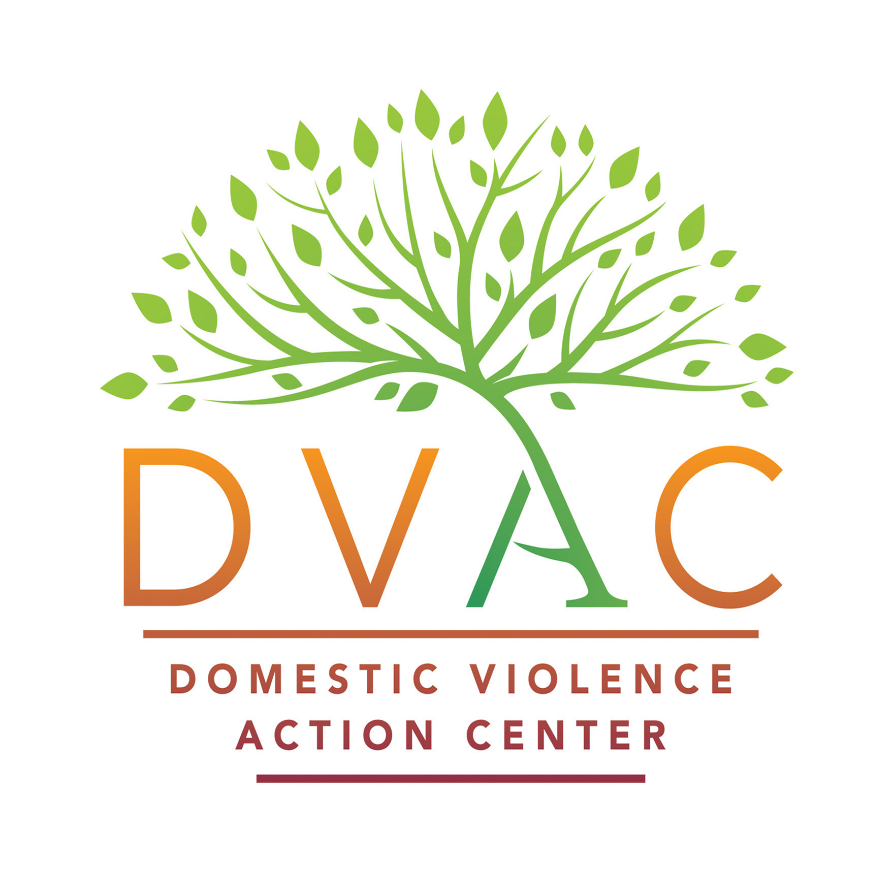

 

 

**This application** ...
Summary

 

 

**The next part of the project** 
 
 

**Final presentation video**
[!https://www.youtube.com/watch?v=g9V9sGhEgdI](https://www.youtube.com/watch?v=g9V9sGhEgdI)
